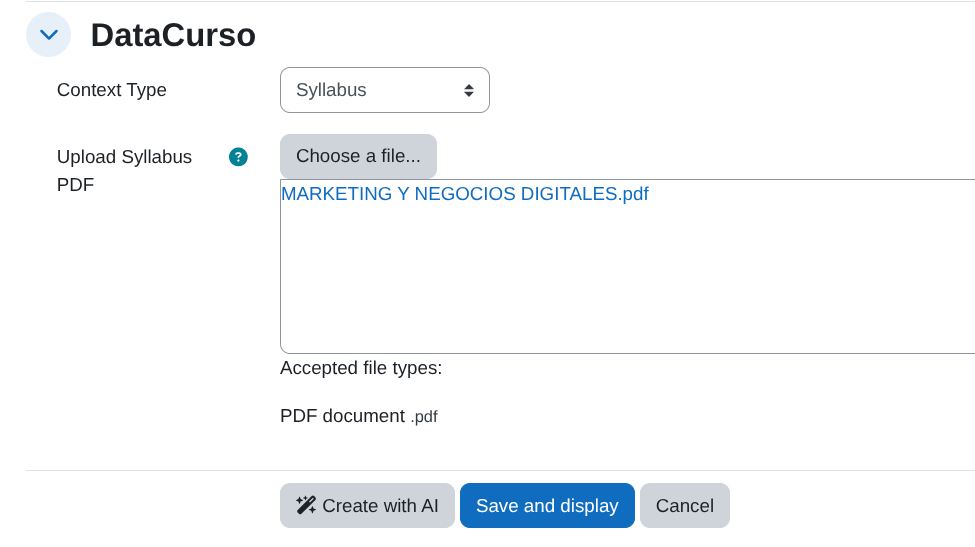
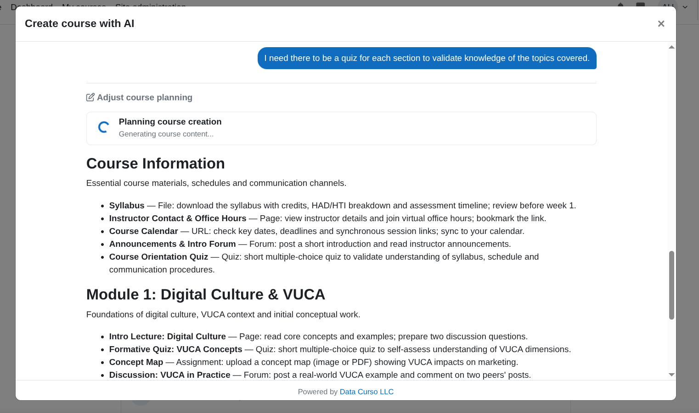
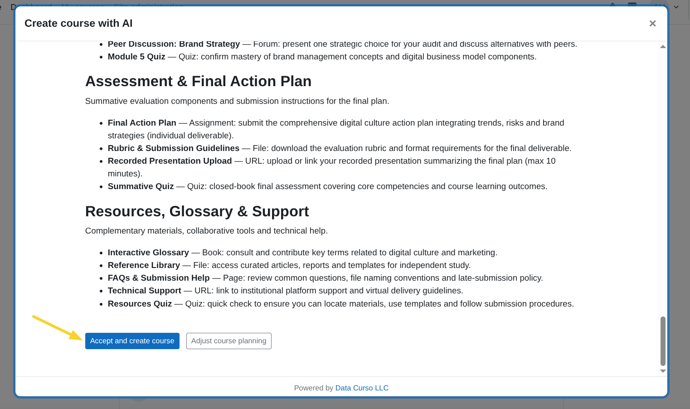
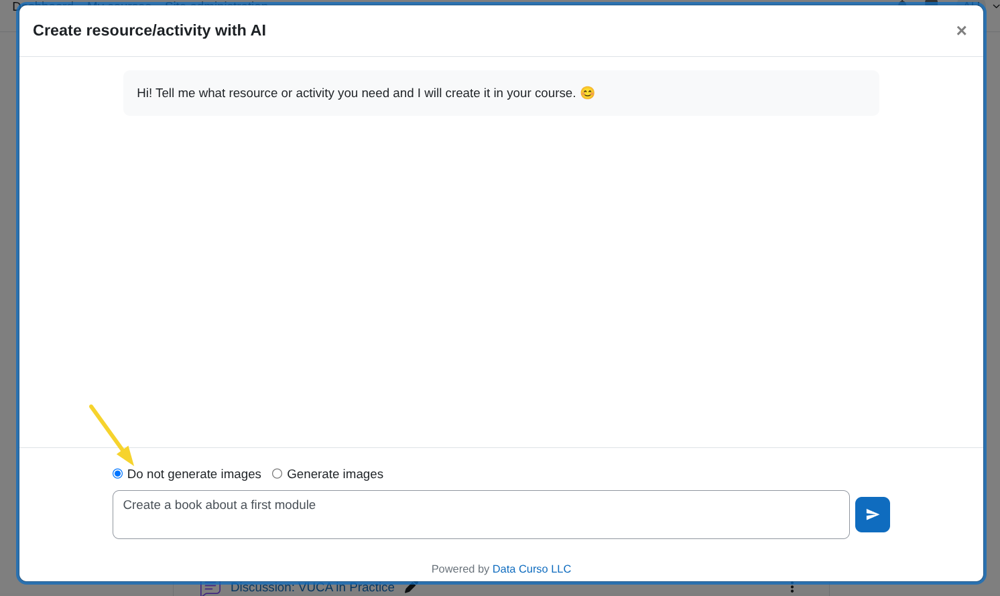

# Course Creator AI

The **Datacurso Course Creator AI** plugin empowers Moodle teachers to **generate complete courses automatically using artificial intelligence**.  
It offers two flexible creation modes — via a **syllabus** or through an **instructional design model** — allowing teachers to build structured, pedagogically sound courses in minutes.

This plugin also enables the **independent creation of activities** within any existing course, giving educators the ability to enhance their classes with AI-generated learning activities at any time.

This plugin is part of the suite of **Datacurso AI Plugin Suite**.

## The Datacurso AI Plugin Suite

Transform Moodle into a **smarter, faster, and more engaging learning platform** with the **Datacurso AI Plugin Suite** — a collection of next-generation tools that bring artificial intelligence directly into your LMS.  
All plugins in this suite are powered by the **Datacurso AI Provider**.

### Explore the Suite

- **[Ranking Activities AI](https://moodle.org/plugins/local_datacurso_ratings)**
  Empower students to rate course activities while AI analyzes feedback and provides deep insights to educators.

- **[Forum AI](https://moodle.org/plugins/local_forum_ai)**  
  Introduce an AI assistant into your forums that contributes to discussions and keeps engagement alive.

- **[Assign AI](https://moodle.org/plugins/local_assign_ai)**  
  Let AI review student submissions, suggest feedback, and support teachers in the grading process.

- **[Share Certificate AI](https://moodle.org/plugins/local_socialcert)**  
  Celebrate achievements automatically! AI generates personalized social media posts when students earn certificates.

- **[Student Life Story AI](https://moodle.org/plugins/report_lifestory)**  
  Gain a complete view of student performance with AI-generated summaries across all enrolled courses.

## Key Features

- **Full Course Generation:** Create entire Moodle courses automatically based on a syllabus or instructional model.  
- **AI-Powered Activities:** Generate interactive, engaging activities that align with your course objectives.  
- **Instructional Flexibility:** Combine AI creativity with structured educational models to ensure quality learning experiences.  
- **Independent Activity Creation:** Add new AI-generated activities to any course on demand. 


## Pre-requisites

1. Moodle 4.5
2. Install the Moodle AI provider **DataCurso AI Provider**. Download it for free from [https://moodle.org/plugins/aiprovider_datacurso/versions](https://moodle.org/plugins/aiprovider_datacurso/versions).
3. In the DataCurso AI Provider settings, configure a valid license key as documented at [https://docs.datacurso.com/index.php?title=Datacurso_AI_Provider#Getting_license_keys](https://docs.datacurso.com/index.php?title=Datacurso_AI_Provider#Getting_license_keys).

### IMPORTANT
This plugin will not function unless the **DataCurso AI Provider** plugin is installed and licensed.

## Installing via uploaded ZIP file

1. Log in to your Moodle site as an admin and go to `Site administration > Plugins > Install plugins`.
2. Upload the ZIP file with the plugin code. You should only be prompted to add
   extra details if your plugin type is not automatically detected.
3. Check the plugin validation report and finish the installation.

## Installing manually

The plugin can be also installed by putting the contents of this directory to

`{your/moodle/dirroot}/local/coursegen`

Afterwards, log in to your Moodle site as an admin and go to `Site administration > Notifications` to complete the installation.

Alternatively, you can run

```bash
php admin/cli/upgrade.php
```

to complete the installation from the command line.

## Manage system instructions

System instructions let you define reusable guidance that reinforces the selected context (`Syllabus` or `Custom prompt`) when creating a course.
They describe how the AI should generate content: tone, structure, level of detail, constraints, and specific rules that must always be respected while producing sections, activities, and resources.

To manage system instructions:

1. Log in to your Moodle site as an admin and go to `Site administration > Plugins > Course Creator AI > Manage system instructions`.
   
  

1. Click on `Add new system instruction` to create a new instruction.

  

2. Fill in the form fields:
   - **Name**: Enter a clear name for the system instruction you will reuse across courses.
   - **Description**: Provide detailed rules and guidelines the AI must follow when generating course content (e.g. structure of sections and activities, constraints, etc.).
   - Click on `Save changes`.


1. You can edit or delete system instructions at any time with the `Edit` and `Delete` buttons from the ***Manage system instructions*** page.

  


## Create a Course with Datacurso AI

Follow these steps to create a new course using the Datacurso AI workflow:

### Open the course creation page
- **Path A**: `Site administration > Courses > Manage courses and categories` and click the **Create new course** button.

    

- **Path B**: From your **My courses area**, click the **Create course** button.

    

### Fill in basic course details
- Complete standard fields like `Course full name`, `Course short name`, `Course category`, `Course format`, and any other  required fields.

   

### Configure the Datacurso section

The `Datacurso` section controls how the AI will understand the course you want to create. It is divided into three main parts:

- **1. Context type**
  - Use the **Context Type** selector to choose how you will provide the main context for the course:
    - **Custom prompt**: You describe the course context manually.
    - **Upload Syllabus (PDF)**: You provide an existing syllabus document.

    

- **2. Context details**
  - **If you choose Custom prompt**
    - A textarea labeled **Prompt for AI** appears.
    - Enter a clear and detailed prompt that describes how you want the course to be generated (objectives, student profile, content, level, constraints, examples, etc.).
    
    

  - **If you choose Upload Syllabus (PDF)**
    - A file picker labeled **Upload Syllabus PDF** appears.
    - Upload a PDF with the course syllabus. It will be sent to the AI for context analysis.
    
    

- **3. Optional system instructions (for any context type)**
  - You can reinforce **either** context type (`Custom prompt` or `Syllabus`) with a reusable system instruction.
  - Tick the checkbox **Activate to use a system instruction** to enable this feature.
  - If there are system instructions configured (see [Manage system instructions](#manage-system-instructions)):
    - A selector labeled **System instruction to apply** appears with the available options.
    - The selected system instruction will be applied together with the chosen context (prompt or syllabus) when generating the course.
  - If there are no system instructions configured:
    - A notice is shown with a link to the ***Manage system instructions*** page so you can create them.

  
      

### Plan with AI

- Click **Create with AI** to start the AI planning process.

  

- A modal window will open and display the planning progress.

  

- Once the plan is generated, you can optionally adjust it by clicking **Adjust course planning**, then provide a prompt with your instructions to re-plan.

  

- The progress of the plan adjustment will be displayed in the modal window.

  

### Create the course
- When the planning looks good, click **Accept and create course**.

    

- This starts creating the course with planned content.
- The modal will show real-time updates for each phase of the process.

    

- Once the process is completed, it redirects to the created course.

    

### IMPORTANT!
- Do not close the modal window during the planning or creation process to avoid issues with course creation.

## Create an Activity with Datacurso AI

### Check the Datacurso context

Before using the AI activity creator, confirm that the course already has a **Datacurso context** defined.

If the course **already has a context** (for example, an *Instructional Model* or an *uploaded Syllabus PDF*), the AI will automatically use it to generate the activity.

If the course **does not have a context yet**, you can set it from the course settings:

1. Open the course and click **Edit settings**.


3. Go to the **Datacurso** section. The following options will be displayed:  

- **1. Context type**
  - Use the **Context Type** selector to choose how you will provide the main context for the course:
    - **Custom prompt**: You describe the course context manually.
    - **Upload Syllabus (PDF)**: You provide an existing syllabus document.

    

- **2. Context details**
  - **If you choose Custom prompt**
    - A textarea labeled **Prompt for AI** appears.
    - Enter a clear and detailed prompt that describes how you want the course to be generated (objectives, student profile, content, level, constraints, examples, etc.).
    
    

  - **If you choose Upload Syllabus (PDF)**
    - A file picker labeled **Upload Syllabus PDF** appears.
    - Upload a PDF with the course syllabus. It will be sent to the AI for context analysis.
    
    

Once the Datacurso context is set at the course level, it will be automatically reused for all AI-generated activities within that course.

### Start the activity creation

- Enter to the course view and turn the **Edit mode** on.

     

- Next to the standard **Add activity or resource** button, click the new button **Add activity or resource with AI**.

    

### Provide the activity prompt
- A modal window with a chat input will open. Enter a clear prompt describing the activity you want to create (e.g., type of activity, learning objectives, instructions, etc.).

    

### Optional: Images in the activity
- Use the combobox to choose whether the activity should include images. By default this is set to **No not generate images**.

    
 
- If you want to generate images, select **Generate images**.

    

### Start creation
- Press **Enter** in the text field or click the **Send** icon button to begin creating the activity with AI.

    

- The modal will display real-time progress updates for each phase of the process.

    

- Once the process is completed, it redirects to the created activity.

    

### IMPORTANT!
- Do not close the modal window until the process has fully completed to avoid issues with activity creation.

## License

2025 Data Curso LLC <https://datacurso.com>

This program is free software: you can redistribute it and/or modify it under
the terms of the GNU General Public License as published by the Free Software
Foundation, either version 3 of the License, or (at your option) any later
version.

This program is distributed in the hope that it will be useful, but WITHOUT ANY
WARRANTY; without even the implied warranty of MERCHANTABILITY or FITNESS FOR A
PARTICULAR PURPOSE.  See the GNU General Public License for more details.

You should have received a copy of the GNU General Public License along with
this program.  If not, see <https://www.gnu.org/licenses/>.
